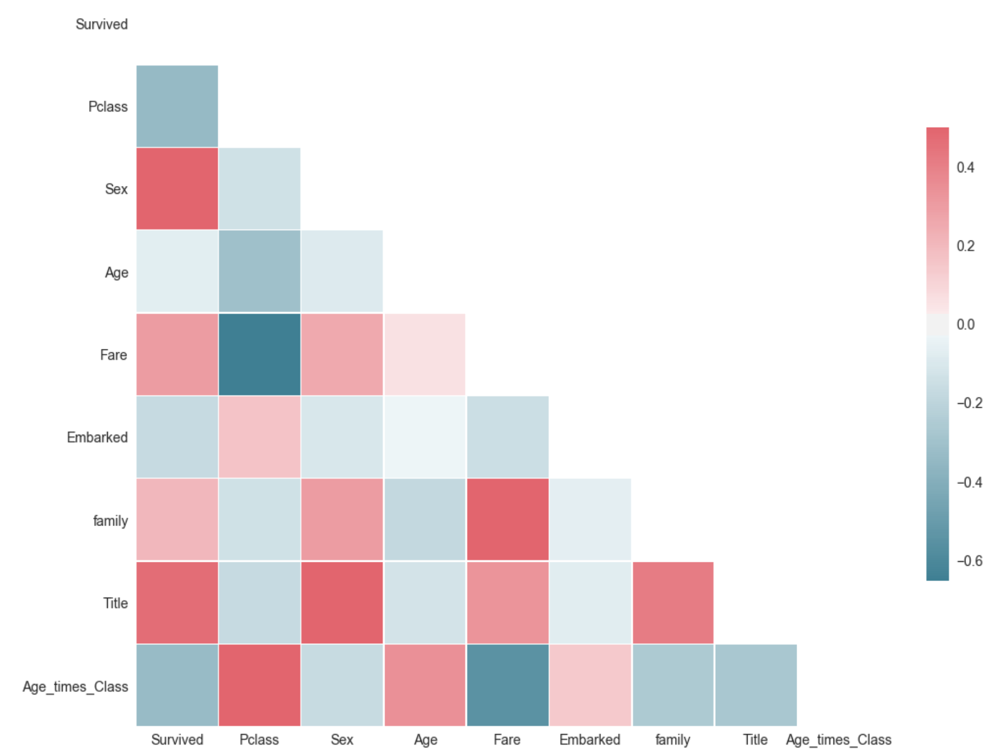
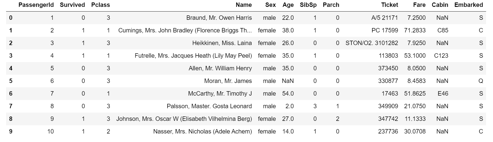
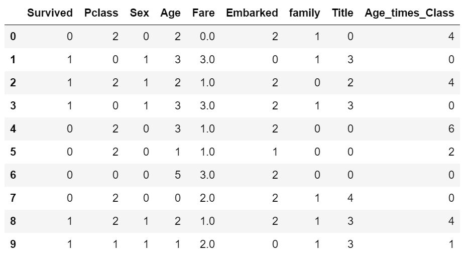
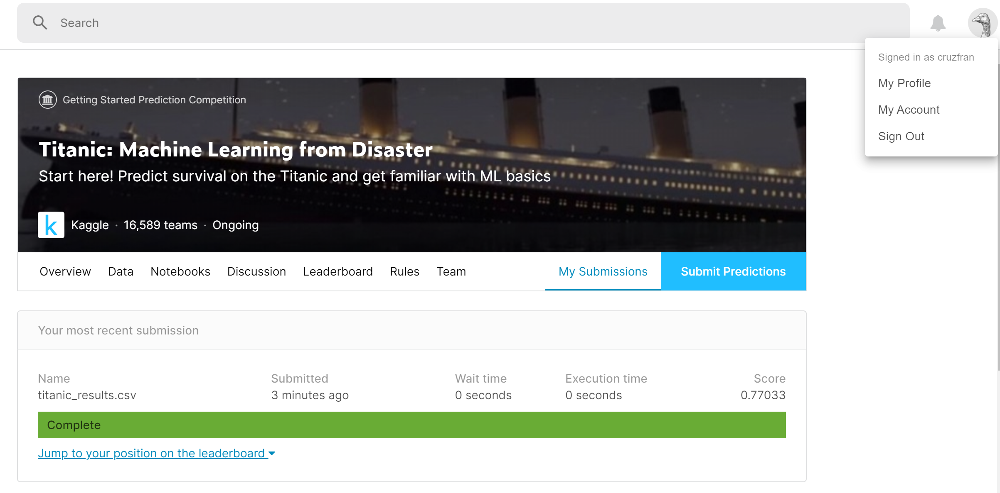

# Titanic Kaggle Competition

This is my coding repository and my first attempt at tackling a Kaggle competition. Other projects that I have finished were sourced from Kaggle but this is my first competition where I submitted it for the official Kaggle leaderboards and scoring. 

The titanic challenge is simple: "Use machine learning to create a model that predicts which passengers survived the Titanic shipwreck." 
For more information about the challenge, please see: https://www.kaggle.com/c/titanic/overview 

## Summary of Exploratory Analysis, Data Processing and Cleaning, and Results

### Exploratory Analysis
A summary of the exploratory analysis is the following:
- Younger folks were more likely to survive compared to the elderly. 
- Males are more likely to have perished in the accident. 
- Amount of fare and ticket class type is a large indicator of the survivability of a passenger. If a passenger is in Class 1 or has paid a large fare, that individual was more likely to survive compared to a Class 3 passenger or a person who paid a cheap fare.
- Embarkment location is also an indicator but this is not reliable as there are more data for one specific location compared to the rest. 
- Extracting titles from the Names of passengers is also a useful tool in helping predict the social status of the individual and, in turn, can be related to the class type/fare feature. This has been very useful from reading the post of another individual's attempt to this challenge https://www.kaggle.com/startupsci/titanic-data-science-solutions

### Data Processing and Cleaning
- Looking into the correlation between the factors listed above and the survivability of the passengers, I have processed and cleaned the data to contain these features (converted from categorical string information to numerical features). 
- I've also experimented with feature engineering by extracting titles, grouping numerical data into bins, and creating a new feature such as Age multipled by Class

Correlation Matrix: 

Before Processing and Cleaning: 

After Processing and Cleaning: 

### Model Results
- I've implemented a Random Forest Classifier after fiddling around with other ML models. RF seems to be the most intuitive and scored the highest compared to the Logistic Regression, etc.
- After hyperparameter tuning, I submitted my results and achieved a 0.77, which was higher than my first attempt of 0.67. 

